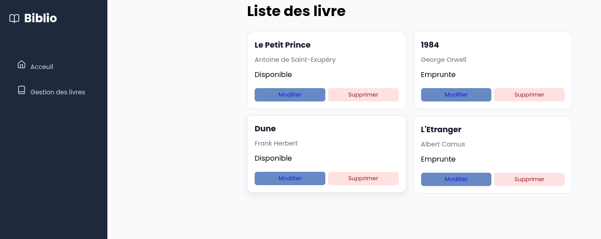

Nom de projet : Gestion de Mini-Bibliotheque

Les membres :

ANDRIAMAHARINTSOA Nomena Tsiafoy Aldino
ANDRIAMIHAJA Hanitriniaina Emilia
RAFANOMEZANTSOANIAINA Mandimbihasina
AMIR Rahim Jhon's
TSIMAROFY Romina Olivia
RAKOTOARIMALALA Mitia Mendrika Hankasitrahana
ANDRIAMAMPIHAJA Carmelo
RASOLOFOHARIFARA Marie Rosa
RAJAOSOLO Manandrazana Eraelien
CLEMENT Brice
RAHERIJAONA Manda Fitahiana
RAFALISON Mury Charmelino
RAFANAMBINAMBOLA Tantely Noelinah

 Une application simple pour gérer une petite liste de livres. 
 Fonctionnalités minimales : Ajouter, modifier et supprimer un livre ; rechercher un livre ; indiquer si le livre est disponible ou emprunté.

 Apres avoir faire un git pull, il faut faire "npm install" dans le terminal pour installer tout les outils comme "router-vue" et "vite-plugin-webfont-dl"

 
 

 ## 🎥 Démonstration du projet

### Présentation générale

Mini-Bibliothèque est une application web développée avec Vue.js qui permet de gérer une collection de livres. Elle propose une interface permettant de consulter les livres et d'effectuer différentes opérations de gestion.

### Scénario de démonstration

Lors de la présentation, nous allons montrer les fonctionnalités suivantes :

1. *Affichage des livres :* présenter la liste des livres enregistrés dans l'application.
2. *Ajout d'un livre :* saisir les informations d'un nouveau livre et vérifier qu'il apparaît dans la liste.
3. *Modification d'un livre :* sélectionner un livre, modifier ses informations et vérifier que les changements sont enregistrés.
4. *Suppression d'un livre :* supprimer un livre et vérifier qu'il disparaît de la liste.

Remarque : seules les fonctionnalités effectivement opérationnelles doivent être présentées comme terminées.

### ✅ Conclusion

Ce projet nous a permis de mettre en pratique nos connaissances en développement web, en JavaScript, en Vue.js et en travail collaboratif avec Git et GitHub.